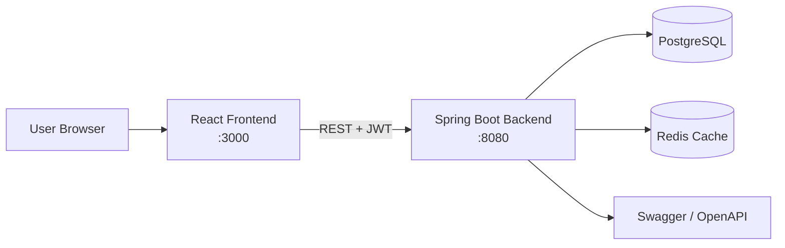

# Healthcare ERP System

A full-stack Healthcare ERP platform for managing healthcare operations end-to-end: geographic hierarchy, users and roles, patient onboarding, consultations, billing, wallet operations, commission distribution, and pharmacy inventory workflows.

## Key Features

- **Role-Based Access Control (RBAC):** Super Admin, Admin, State Manager, District Manager, Block Manager, Doctor, Receptionist, Pharmacist, HR Manager, Associate, Family.
- **Geographic Hierarchy Management:** State → District → Block → Center scoped access and assignment.
- **Patient & Family Wallet Management:** Family enrollment, health identity, wallet top-up, and transaction-safe balance updates.
- **Appointment & Consultation Workflow:** Reception token handling, doctor queue, consultation capture, and treatment lifecycle.
- **Billing, Invoicing & Automated Commissions:** Invoice generation, payment capture, and multi-level commission allocation.
- **Inventory & Pharmacy Management:** Medicine catalog, stock batches, dispensing, and inventory visibility.

## Tech Stack

### Frontend
- React
- Tailwind CSS
- React Query

### Backend
- Spring Boot 3
- Spring Security (JWT)
- Spring Data JPA
- REST APIs

### Database & Caching
- PostgreSQL
- Redis

### DevOps & Tooling
- Docker
- Docker Compose
- GitHub Actions
- Swagger / OpenAPI

## Getting Started (Docker Compose)

### 1) Configure environment
From the project root:

```bash
cp .env.example .env
```

Update secrets in `.env` before running in shared or production-like environments.

### 2) Start the full stack

```bash
docker-compose up -d
```

### 3) Access services

- **Frontend:** http://localhost:3000
- **Backend API base:** http://localhost:8080
- **Swagger UI:** http://localhost:8080/swagger-ui.html

### Authentication / First User

No hardcoded default credentials are shipped.
Use `POST /api/auth/register` to create the first user, then log in with `POST /api/auth/login`.
`/api/v1/auth/*` is also supported as a versioned alias.

## Screenshots

> Placeholder image paths are pre-wired under `docs/`. Replace with real screenshots when available.


## Architecture Overview



## Repository Structure

```text
.
├── backend/               # Spring Boot backend (Dockerfile, pom.xml, src/)
├── frontend/              # React application + frontend Dockerfile
├── docker-compose.yml     # Full-stack orchestration
├── .env.example           # Environment template
└── .github/workflows/ci.yml
```

## CI

GitHub Actions workflow (`.github/workflows/ci.yml`) validates:
- Backend build/tests (`cd backend && mvn -B clean package`)
- Frontend build (`npm ci && npm run build`)
- Docker Compose build verification
